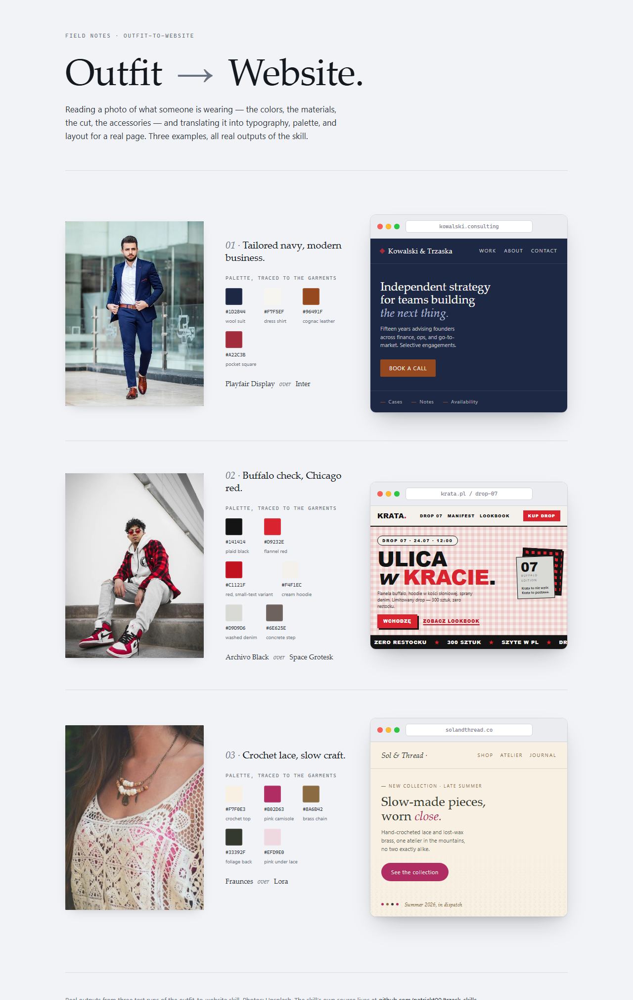

# trzask-skills

A collection of [Claude skills](https://docs.claude.com/en/docs/claude-code/skills) by [@patrickt00](https://github.com/patrickt00). Licensed under the [MIT License](LICENSE).

## Repo layout

```
skills/     — one folder per skill (the actual skill sources)
dist/       — packaged .skill bundles, ready to install
docs/       — per-skill screenshots, previews, extra docs
```

## Install a skill

Either drop the packaged bundle into Claude:

- Open `dist/<skill-name>.skill` — Claude prompts to install it into your profile.

Or copy the source folder into your local skills directory:

- Copy `skills/<skill-name>/` into `~/.claude/skills/` (Windows: `%USERPROFILE%\.claude\skills\`).

---

## Skills

### 🧵 outfit-to-website

**Convert a photo of an outfit into a full website design.** Given a picture of a person, an outfit, or a piece of clothing, the skill produces a design system traced back to the garments (`design-tokens.md`) and a self-contained Tailwind demo page (`index.html`).

<!-- Screenshots render in whichever theme GitHub is showing. -->
<picture>
  <source media="(prefers-color-scheme: dark)" srcset="docs/outfit-to-website/screenshots/preview-dark.png">
  
</picture>

Three real runs are shown above — the source outfit on the left, the palette (every hex traced to a specific garment) and font pairing in the middle, the resulting demo page in the browser frame on the right. See individual crops: [navy](docs/outfit-to-website/screenshots/case-navy.png) · [streetwear](docs/outfit-to-website/screenshots/case-streetwear.png) · [boho](docs/outfit-to-website/screenshots/case-boho.png).

Or [watch the 15-second walkthrough](docs/outfit-to-website/preview.mp4) — the three transformations animated in sequence, rendered from HTML with [HyperFrames](https://github.com/heygen-com/hyperframes). Composition source and reproduction steps: [`docs/outfit-to-website/hyperframes-source/`](docs/outfit-to-website/hyperframes-source/).

<video src="https://github.com/patrickt00/trzask-skills/raw/main/docs/outfit-to-website/preview.mp4" controls muted playsinline width="880" poster="docs/outfit-to-website/screenshots/preview-dark.png">
  Your browser can't play the inline video —
  <a href="docs/outfit-to-website/preview.mp4">download preview.mp4</a> instead.
</video>

#### Try it

Attach a photo of an outfit and ask, in any language:

- **English —** *"Turn this into a website design for my personal portfolio — I'm a freelance consultant."*
- **English —** *"Convert this look into a landing page — you pick what the brand should be."*
- **Polish —** *"Zobacz zdjęcie outfit.jpg — chcę stronę w klimacie tej stylizacji, coś dla marki streetwearowej."*

You get back two files: `design-tokens.md` (concept, palette with garment attribution, typography, spacing, WCAG contrast checks) and `index.html` (self-contained landing page, Tailwind CDN, no build step). Open the HTML in a browser.

#### How it works

- The mapping engine ([`references/mapping-guide.md`](skills/outfit-to-website/references/mapping-guide.md)) translates outfit features into design decisions: colors → palette roles, materials → textures, formality → typography, cut → layout, accessories → micro-details, patterns → motifs.
- Every text/background contrast pair is computed with the bundled [`scripts/extract_palette.py`](skills/outfit-to-website/scripts/extract_palette.py) so documented ratios are exact, not estimated.
- Signature outfit colors are never muted for AA margin — the skill flips the role (e.g. white text *on* the vivid accent) instead.

**Sources:** [skill folder](skills/outfit-to-website/) · [packaged bundle](dist/outfit-to-website.skill) · [more screenshots](docs/outfit-to-website/screenshots/)
